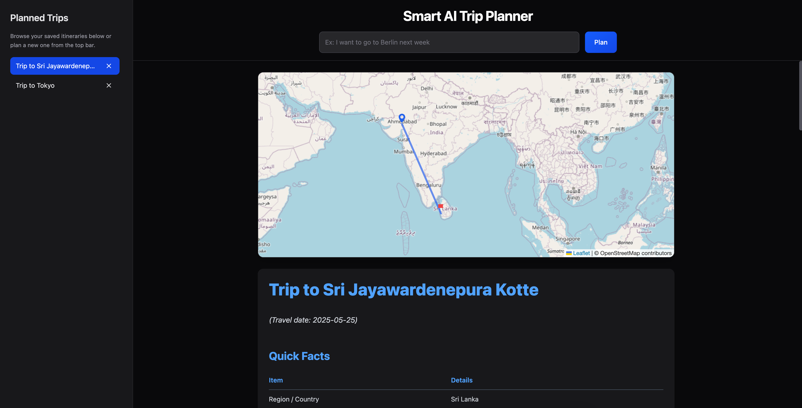

> Here’s a complete and professional README.md tailored to your Smart AI Trip Planner project, including setup, features, deployment, and usage.


# 🌍 Smart AI Trip Planner

A futuristic AI-powered web app to generate complete travel plans in seconds.  
Built with **SvelteKit**, **TailwindCSS**, **OpenRouter LLM powered by Cerebras**, and **Leaflet** maps.



🔗 **Live Demo**: [trip-planner-ecru-six.vercel.app](https://trip-planner-ecru-six.vercel.app/)

---

## ✨ Features

- 🧠 **AI Travel Plans** — Enter any natural language like “I want to go to Berlin next week”  
- 📅 **One-Day Itinerary** — Get location-aware schedule, budget, weather, checklist, & more  
- 🗺️ **Interactive Map** — See route from your live location to destination  
- 🧾 **Markdown-Rendered Guide** — Rich sections rendered beautifully using Tailwind Typography  
- 💾 **Trip History** — Sidebar to switch between previously planned trips  
- 🌙 **Dark Mode Support** — Fully styled for dark environments  
- 📱 **Responsive UI** — Mobile-first, with a toggleable sidebar and clean layout

---

## 🛠️ Tech Stack

| Layer       | Tech                        |
|-------------|-----------------------------|
| Frontend    | SvelteKit + Tailwind CSS    |
| Styling     | `@tailwindcss/typography`   |
| AI Backend  | OpenRouter LLM + Cerebras (qwen/qwen3-32b) |
| Mapping     | Leaflet.js (OpenStreetMap)  |
| Deployment  | [Vercel](https://vercel.com/) |

---

## 🚀 Setup Instructions

### 1. Clone this repo

```bash
git clone https://github.com/your-username/trip-planner.git
cd trip-planner

2. Install dependencies

pnpm install

3. Configure environment

Create a .env file with:

OPENROUTER_API_KEY=your_openrouter_key_here

You can get a key from https://openrouter.ai

⸻

▶️ Run the app locally

pnpm dev
```

Visit http://localhost:5173
The app will automatically detect your location and is ready for inputs like:

```
“Plan a trip to Tokyo in July”
“I want to go to Goa this weekend”
```

📦 Build for production
```
pnpm build
pnpm preview
```

---

📡 Deployed App

The app is deployed via Vercel at:
🔗 https://trip-planner-ecru-six.vercel.app/

---

🧩 Key Project Files

File	Purpose
src/routes/+page.svelte	Main UI (input, layout, rendering)
src/lib/api/planTrip.ts	LLM logic (formatting, weather, prompt)
src/lib/Map.svelte	Leaflet-based interactive map
src/lib/Sidebar.svelte	Scrollable trip history list
tailwind.config.js	Dark mode, typography config

---

📌 Notes
	•	Markers are rendered using inline SVG via DivIcon, so they work even on Vercel.
	•	LLM prompt is carefully structured to return full trip guide in Markdown.
	•	If response fails, the UI handles errors gracefully.

---

📤 Future Ideas
	•	✅ Save trips by user (auth layer)
	•	✅ JSON output → tabbed UI
	•	✅ Travel APIs for real flight or hotel info
	•	✅ Offline access / export plan as PDF

---

📄 License

MIT — free to use, modify, deploy.

---

Let me know if you want:
- a badge section (e.g. Vercel build / license)
- deploy instructions for other platforms (Render / Netlify)
- example screenshots embedded in README